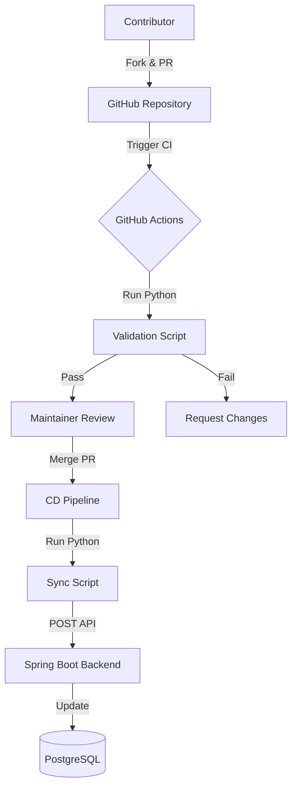

# GitOps Pipeline: Community-Driven Data Ingestion

This document details the automation pipeline that enables community contributions to the Programming Language Genealogy platform while maintaining data integrity and system stability.

## 1. Overview

The platform uses a **GitOps** approach where the "Source of Truth" for language data resides in a dedicated directory within the repository (e.g., `/data/languages`). Changes to the production database are never made manually; they are the result of merged Pull Requests.

---

## 2. The Workflow

---

## 3. Pipeline Phases

### Phase 1: Contribution (User)
- **Files:** Data is stored as individual `.json` (metadata) and `.md` (descriptions) files.
- **Process:** Contributors fork the repo, add or edit files in the `/data` directory, and submit a Pull Request.

### Phase 2: Validation (CI)
Triggered automatically on every PR update.
- **Tools:** Python 3.x, `jsonschema`.
- **Checks:**
    - **Schema Validation:** Ensures all required fields (id, name, releaseDate) are present and correctly formatted.
    - **Link Integrity:** Verifies that `sourceId` and `targetId` in relationships point to existing language files.
    - **Markdown Linting:** Ensures descriptions follow the "Liquid Glass" content standards.
    - **Duplicate Check:** Prevents multiple entries for the same language.

### Phase 3: Synchronization (CD)
Triggered only when a PR is merged into the `main` branch.
- **Process:**
    1.  The GitHub Action identifies changed files using `git diff`.
    2.  A Python script parses the updated data.
    3.  The script sends a secure authenticated request to the Backend API (`/api/v1/internal/sync`).
    4.  The Backend updates the PostgreSQL database and clears relevant caches.

---

## 4. Automation Details

### GitHub Actions Configuration (`.github/workflows/data-sync.yml`)
- **Triggers:** `pull_request` (on `/data/**`) and `push` (to `main`).
- **Environment:**
    - `PYTHON_VERSION`: 3.10
    - `API_SYNC_KEY`: Stored in GitHub Secrets.

### Python Scripting Responsibilities
- **`validate.py`**: Local check that fails the build if data is malformed.
- **`sync.py`**: Orchestrates the API call to the production environment.

---

## 5. Security Considerations
- **Write Access:** The production database is firewalled; only the Backend API can write to it.
- **API Security:** The `/internal/sync` endpoint requires a rotating high-entropy API key passed via the `X-API-Key` header.
- **Review Requirement:** All PRs must be approved by at least one maintainer before the CD pipeline can trigger.
