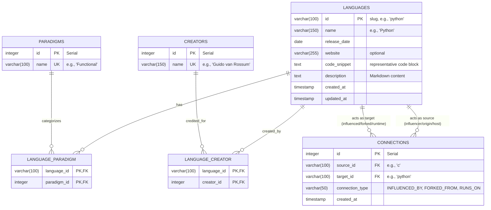

# Database Schema & Entity Relationship Diagram (ERD)

This document details the PostgreSQL database schema for the Programming Language Genealogy platform, including table structures, relationship types, indices, and a visual Entity Relationship Diagram.

---

## 1. Entity Relationship Diagram (ERD)

The following Mermaid diagram represents the relational model of our database. It uses normalized tables for languages, paradigms, and creators, and a junction table for language-to-language connections (edges) with typed metadata.



---

## 2. Table Specifications

### 2.1 `languages` Table
Stores the primary details of each programming language.

| Column | Type | Constraints | Description |
| :--- | :--- | :--- | :--- |
| `id` | `VARCHAR(100)` | `PRIMARY KEY` | Lowercase URL-friendly slug (e.g., `cpp`). |
| `name` | `VARCHAR(150)` | `NOT NULL` | The human-readable name of the language. |
| `release_date` | `DATE` | `NOT NULL` | The date of initial release (YYYY-MM-DD). |
| `website` | `VARCHAR(255)` | `NULL` | Link to the official website or documentation. |
| `code_snippet` | `TEXT` | `NULL` | Representative "Hello World" or unique syntax. |
| `description` | `TEXT` | `NOT NULL` | Markdown content rendered in the modal. |
| `created_at` | `TIMESTAMP` | `DEFAULT CURRENT_TIMESTAMP` | Internal audit field. |
| `updated_at` | `TIMESTAMP` | `DEFAULT CURRENT_TIMESTAMP` | Internal audit field. |

### 2.2 `connections` Table
Junction/relationship table representing the directed edges in the genealogy graph.

| Column | Type | Constraints | Description |
| :--- | :--- | :--- | :--- |
| `id` | `SERIAL` | `PRIMARY KEY` | Auto-incrementing identifier. |
| `source_id` | `VARCHAR(100)` | `NOT NULL`, `FOREIGN KEY` (references `languages.id`) | The origin/parent node in the relationship. |
| `target_id` | `VARCHAR(100)` | `NOT NULL`, `FOREIGN KEY` (references `languages.id`) | The destination/child node in the relationship. |
| `connection_type` | `VARCHAR(50)` | `NOT NULL`, `CHECK` constraint | Must be: `INFLUENCED_BY`, `FORKED_FROM`, or `RUNS_ON`. |
| `created_at` | `TIMESTAMP` | `DEFAULT CURRENT_TIMESTAMP` | Internal audit field. |

> [!NOTE]
> A unique constraint is placed on `(source_id, target_id, connection_type)` to prevent duplicate edges between the same two languages.

### 2.3 `paradigms` Table
A dictionary table of language paradigms (e.g., Object-Oriented, Functional, Logic).

| Column | Type | Constraints | Description |
| :--- | :--- | :--- | :--- |
| `id` | `SERIAL` | `PRIMARY KEY` | Auto-incrementing identifier. |
| `name` | `VARCHAR(100)` | `NOT NULL`, `UNIQUE` | Paradigm name. |

### 2.4 `language_paradigm` Table (Junction)
Maps many-to-many relationships between languages and paradigms.

| Column | Type | Constraints | Description |
| :--- | :--- | :--- | :--- |
| `language_id` | `VARCHAR(100)` | `PRIMARY KEY`, `FOREIGN KEY` (references `languages.id`) | Language identifier. |
| `paradigm_id` | `INTEGER` | `PRIMARY KEY`, `FOREIGN KEY` (references `paradigms.id`) | Paradigm identifier. |

### 2.5 `creators` Table
A dictionary table for language creators, which can be individual authors or organizations.

| Column | Type | Constraints | Description |
| :--- | :--- | :--- | :--- |
| `id` | `SERIAL` | `PRIMARY KEY` | Auto-incrementing identifier. |
| `name` | `VARCHAR(150)` | `NOT NULL`, `UNIQUE` | Creator's name. |

### 2.6 `language_creator` Table (Junction)
Maps many-to-many relationships between languages and creators.

| Column | Type | Constraints | Description |
| :--- | :--- | :--- | :--- |
| `language_id` | `VARCHAR(100)` | `PRIMARY KEY`, `FOREIGN KEY` (references `languages.id`) | Language identifier. |
| `creator_id` | `INTEGER` | `PRIMARY KEY`, `FOREIGN KEY` (references `creators.id`) | Creator identifier. |

---

## 3. Database Constraints & Rules

1. **Delete Cascade Policy**: 
   When a language is deleted from `languages`, all corresponding entries in `connections`, `language_paradigm`, and `language_creator` must be deleted automatically via `ON DELETE CASCADE` foreign key configurations.
2. **Self-Referential Edge Validation**: 
   A check constraint on the `connections` table ensures `source_id <> target_id`, preventing a language from connecting to itself.

---

## 4. Indexing & Query Optimization

To keep the interactive frontend load times low, database indexing is applied to target common query access patterns:

* **Graph Load Optimization**:
  ```sql
  CREATE INDEX idx_connections_source ON connections(source_id);
  CREATE INDEX idx_connections_target ON connections(target_id);
  ```
  *Why:* The backend frequently queries both incoming and outgoing connections to build the interactive force-directed graph structure.

* **Search & Filter Optimization**:
  ```sql
  CREATE INDEX idx_languages_name ON languages(name);
  ```
  *Why:* Allows for rapid, indexed lookups when users type into the auto-complete search bar.
